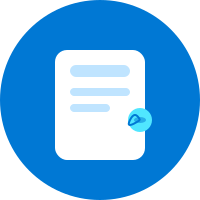

# 👋 Hi there, I’m Damilare!

**Senior .NET Engineer & Cloud Architect** with 8+ years of experience designing and scaling **high-performance, cloud-native financial systems** using **.NET Core** and **Azure**.  
I specialize in **modernizing legacy platforms, building resilient event-driven microservices, and applying cloud design patterns** to solve complex business problems.

- ⚡ Architected **cloud-native doc generation platform** scaling to **500k+ daily docs** at **99.8% reliability**  
- 💰 Optimized Azure infrastructure — **cut costs by 18%** while improving performance by **30%**  
- 🧩 Strong in **Microservices | DDD | Event-Driven | Cloud Patterns | AI/ML Integration**  
- 🎓 MSc, Global Software Development (Germany) | BSc, Computer Science (Nigeria)  
- 📜 Certified: **Azure Developer Associate, Azure Fundamentals, PSM I, OWASP SKF100**, (Azure Solutions Architect in progress)  

---

## 🛠️ Tech Stack

### 💻 Languages & Frameworks  
| C# | .NET Core | JavaScript | Angular | SQL | gRPC |
|----|-----------|------------|---------|-----|------|
|  |  |  |  |  |  |

### ☁️ Cloud & Infrastructure  
| Azure | Docker | Kubernetes | Terraform | Helm | Kafka | RabbitMQ |
|-------|--------|------------|-----------|------|-------|----------|
|  |  |  |  |  |  |  |

---

### 🧠 Data & AI/ML  
| SQL Server | PostgreSQL | MongoDB | Cosmos DB | Azure OpenAI |  <abbr title="Azure AI Document Intelligence">Azure AI DI</abbr> |
|------------|------------|---------|-----------|--------------|--------------------------------|
|  |  |  |  |  |  |

---

## 🚀 Featured Projects

🔹 **[TaxMate — Automated Invoice Reconciliation](https://github.com/gitdamilare/TaxReturnAutomation)**  
*Azure Functions, DDD, Serverless, Azure AI*  
– Built a serverless, event-driven pipeline for invoice-to-bank reconciliation, reducing manual workload by **60%**.  

🔹 **[Real-Time Logging Dashboard](https://github.com/gitdamilare/RealTimeLogging)**  
*.NET Core, Angular, SignalR*  
– Event-driven logging pipeline ingesting **500+ logs/sec** with real-time dashboards.  

🔹 **AI-powered Document Generation Platform (LPA)** *(Work Project)*  
*.NET, Azure Functions, Kafka, AKS*  
– Scaled to **500k+ daily documents** with 99.8% reliability, cutting **cloud costs by 18%**.  

---

## 📜 Certifications

- Microsoft Certified: **Azure Developer Associate (AZ-204)**  
- Microsoft Certified: **Azure Fundamentals (AZ-900)**  
- Microsoft **Azure Solutions Architect (AZ-305)** *(in progress)*  
- OWASP / Linux Foundation (SKF100): Understanding Top 10 Security  
- **Professional Scrum Master I (PSM I)**  

---

## 📈 GitHub Stats  

  

  
  

  

---

## 🤝 Let’s Connect  

  
  

💡 *Open to collaborations on cloud-native .NET projects, Azure architecture consulting, and innovative fintech solutions.*  

---
